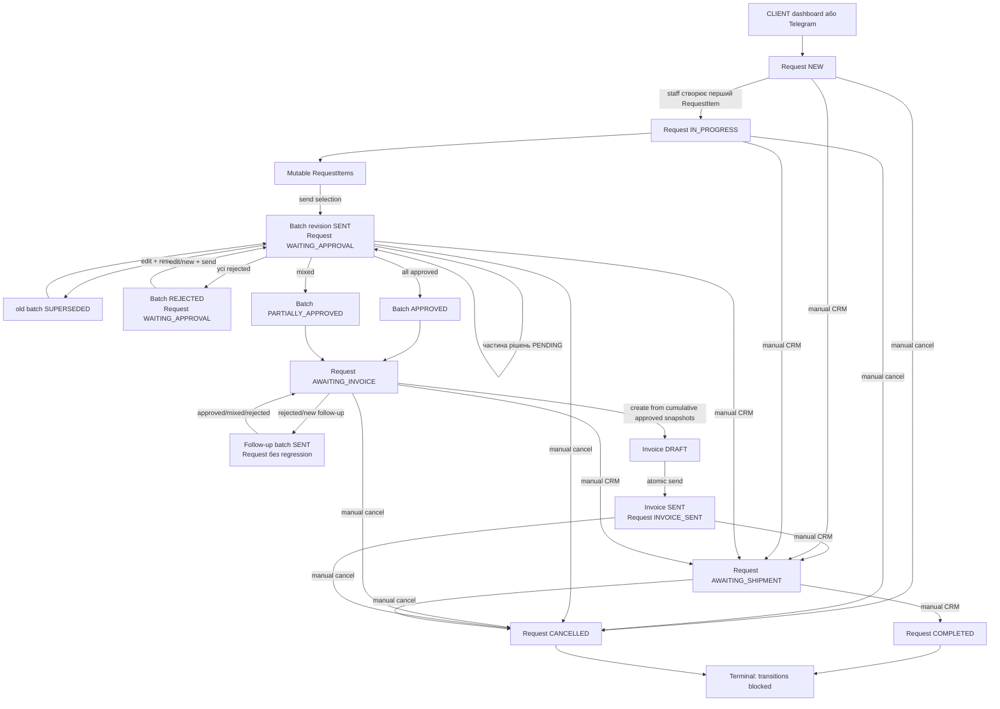

# Kairos Parts — повний аудит життєвого циклу Request

Дата аудиту: 2026-07-30

Гілка: `develop`

Формат: read-only, code-backed architectural audit

Об’єкт: Parts Request lifecycle від створення заявки до завершення або скасування

## 1. Executive summary

Поточний lifecycle Parts Request побудований навколо трьох пов’язаних агрегатів:

1. `Request` — верхньорівневий стан бізнес-процесу.
2. `RequestSelectionBatch` — immutable revision підбору, яку менеджер надсилає клієнту.
3. `Invoice` — фінансовий документ, створений лише з погоджених immutable snapshots.

Canonical зміна `Request.status` зосереджена в
`lib/requests/status-transition.ts`. Сервіс виконує conditional update, записує
`RequestStatusHistory` і `AuditLog` в одній транзакції та повертає `changed`,
`noop` або `blocked`. Основні автоматичні переходи підключені:

```text
NEW
  → IN_PROGRESS
  → WAITING_APPROVAL
  → AWAITING_INVOICE
  → INVOICE_SENT
```

Після `INVOICE_SENT` автоматичне продовження не реалізоване. CRM дозволяє
ADMIN/MANAGER вручну встановити лише `AWAITING_SHIPMENT`, `COMPLETED` або
`CANCELLED`, причому з будь-якого нетермінального стану.

Сильні сторони реалізації:

- immutable versioned approval batches із hash snapshots;
- один активний `SENT` batch на Request на рівні PostgreSQL;
- optimistic/conditional concurrency guards;
- атомарність batch, decision, invoice creation та invoice send mutations;
- approved-only cumulative invoice source;
- canonical Request history і audit для фактичних status transitions;
- CLIENT ownership checks та CRM role checks;
- post-commit Telegram, який не rollback-ить успішну DB transaction;
- reactive action feedback без повного перезавантаження сторінки.

Основні виявлені ризики:

- **High:** `resolveInvoiceSelection()` не перевіряє наявність активного follow-up
  batch зі статусом `SENT`. За наявності попередньо погоджених позицій рахунок
  може бути створено, поки новий follow-up ще очікує рішення.
- **High:** cancellation рахунку не змінює `Request.status`; скасований
  `SENT` invoice може залишити Request у `INVOICE_SENT` без canonical recovery.
- **Medium:** створення draft `RequestItem` дозволено в усіх нетермінальних
  статусах; blocked transition, крім terminal block, не скасовує створення item.
- **Medium:** CLIENT dashboard Request creation не створює початковий
  `RequestStatusHistory`, тоді як Telegram creation створює `NEW` history.
- **Medium:** немає durable outbox/retry для Telegram; process crash після commit
  і до відправлення може втратити повідомлення.
- **Medium:** manual status transition дозволяє пропускати етапи lifecycle.
- **Low/Medium:** Server Action ручного статусу надсилає notification навіть
  для `noop`; API-варіант notification не надсилає.

Аудит не змінює application code, Prisma schema, migrations, БД, Telegram,
env або deployment. Висновки базуються на поточному коді та Stage 2–6 reports;
authenticated browser і live notification delivery не виконувались.

## 2. Основні domain models

### 2.1 Request

`Request` у `prisma/schema.prisma` містить:

- бізнес-ідентифікатори `id`, `requestNumber`, `publicStatusToken`;
- `source` і `status`;
- `selectionRevisionCounter`;
- ownership через `clientId` і `companyId`;
- guest snapshots;
- технічний/vehicle контекст;
- `assignedManagerId`;
- relations до items, batches, invoices, documents, comments, notifications,
  files і status history.

`Request.status` — coarse-grained стан усього процесу, а не детальна копія
batch або invoice status.

### 2.2 RequestItem

`RequestItem` — mutable CRM working state. Менеджер може створювати, редагувати
і видаляти позиції з guards. Поля `visibleToClient`, `approvedByClient`,
`includeInInvoice`, `approvedAt` збережені для legacy compatibility, але
canonical client approval відбувається на `RequestSelectionBatchItem`.

### 2.3 RequestSelectionBatch

Batch — immutable revision підбору:

- `revision` унікальна в межах Request;
- `snapshotSchemaVersion` і SHA-256 `snapshotHash`;
- lifecycle timestamps;
- creator;
- immutable collection `RequestSelectionBatchItem`.

DB migration
`20260727183000_add_request_selection_batch_foundation/migration.sql` створює
partial unique index:

```sql
CREATE UNIQUE INDEX "RequestSelectionBatch_one_sent_per_request"
ON "RequestSelectionBatch"("requestId")
WHERE "status" = 'SENT';
```

Це database source of truth для одного активного approval cycle.

### 2.4 RequestSelectionBatchItem

Batch item зберігає:

- nullable provenance `sourceRequestItemId`;
- immutable commercial/vehicle snapshot;
- `sourceUpdatedAt`;
- власний `snapshotHash`;
- decision state, actor, timestamps і client comment;
- nullable relation до `InvoiceItem`.

### 2.5 Invoice та InvoiceItem

`Invoice` має status `DRAFT | SENT | PAID | CANCELLED`, buyer/seller snapshots,
amounts, currency і lifecycle timestamps. `selectionBatchId` nullable та unique.

`InvoiceItem.selectionBatchItemId` nullable та unique. Це зберігає exact
provenance кожної invoiced позиції. Один Invoice може містити погоджені items
з кількох revisions, тому `Invoice.selectionBatchId` є посиланням на останній
approved batch, а не повним описом походження всіх items.

### 2.6 RequestStatusHistory, AuditLog, Notification

- `RequestStatusHistory` зберігає `oldStatus`, `newStatus`,
  `changedByUserId`, timestamp.
- `AuditLog` зберігає actor snapshots, entity/action/category, allowlisted
  old/new/metadata і request context.
- `Notification` забезпечує delivery observability, але не є durable outbox.

### 2.7 Суміжні legacy aggregates

`CommercialOffer` і `ChangeRequest` залишаються окремими flows. Вони не є
canonical source of truth для batch approval → invoice lifecycle.

## 3. Request statuses

| Status | Семантика | Canonical чи legacy |
|---|---|---|
| `NEW` | нова заявка без draft підбору | canonical |
| `IN_PROGRESS` | підбір у роботі | canonical |
| `OFFER_PREPARING` | старий аналог підбору | legacy/display-normalized |
| `WAITING_APPROVAL` | активний batch очікує рішення CLIENT | canonical |
| `AWAITING_INVOICE` | є хоча б одна погоджена позиція | canonical |
| `INVOICE_SENT` | рахунок атомарно переведено у `SENT` | canonical |
| `AWAITING_SHIPMENT` | очікує відвантаження | canonical manual |
| `ORDERED` | старий shipment-like стан | legacy/display-only |
| `IN_DELIVERY` | старий shipment-like стан | legacy/display-only |
| `COMPLETED` | завершена заявка | terminal |
| `CANCELLED` | скасована заявка | terminal |

Presentation normalization у `lib/requests/statuses.ts`:

- `OFFER_PREPARING` показується як «Підбір у роботі»;
- `ORDERED` та `IN_DELIVERY` — як «Очікує на відвантаження»;
- UI manual options не містять automatic або legacy states.

## 4. Створення заявки

### 4.1 CLIENT dashboard

`POST app/api/requests/route.ts`:

- вимагає authenticated active CLIENT і access context;
- валідує payload/taxonomy/vehicle ownership;
- створює `Request` з `source=CLIENT_DASHBOARD`, `status=NEW`;
- зберігає files послідовно після Request create;
- надсилає staff Telegram notification.

Виявлені особливості:

- початковий `RequestStatusHistory` не створюється;
- Request, filesystem files і `RequestFile` rows не об’єднані однією
  транзакцією;
- form idempotency key відсутній, повторний submit може створити дубль;
- request creation audit не знайдено.

### 4.2 Telegram CLIENT bot

`lib/telegram/session.ts`:

- використовує persistent `TelegramDraftRequest`;
- callback переводить draft у `CREATING`, що обмежує duplicate confirmation;
- створює `Request` з `source=TELEGRAM`, `status=NEW`;
- nested create додає початковий `RequestStatusHistory(newStatus=NEW)`;
- додає internal metadata comment;
- прикріплює files, видаляє draft і повідомляє staff bot.

Request create, file attach і draft deletion не є однією DB transaction.

### 4.3 Інші RequestSource

Enum містить `WEBSITE` і `MANAGER`, але production create paths для Parts
Request із цими source у поточному репозиторії не знайдені. Used Equipment і
Logistics мають окремі models/flows і не входять до цього lifecycle.

## 5. Початок підбору

Canonical trigger: `SELECTION_DRAFT_CREATED`.

`createRequestItemDraft()` у `lib/request-items/create-draft.ts`:

1. читає Request;
2. блокує лише `COMPLETED`/`CANCELLED`;
3. створює hidden `RequestItem`;
4. пише item audit;
5. викликає `transitionRequestStatus()` у тій самій transaction.

Матриця:

```text
NEW + SELECTION_DRAFT_CREATED         → IN_PROGRESS
IN_PROGRESS + SELECTION_DRAFT_CREATED → noop
інші active statuses                  → transition blocked
COMPLETED/CANCELLED                   → весь create rollback
```

Важлива розбіжність: для blocked transition у пізньому нетермінальному статусі
item create не rollback-иться. Service відкидає лише terminal block.

## 6. Робота з RequestItem

### Create

- ADMIN/MANAGER через CRM action;
- `visibleToClient` примусово `false`;
- item audit та перший Request transition атомарні;
- немає form idempotency key.

### Edit

`lib/request-items/update.ts`:

- повторно перевіряє active ADMIN/MANAGER;
- використовує `expectedUpdatedAt` і conditional `updateMany`;
- no-op не створює audit;
- approved snapshot у finalized batch блокує mutation;
- rejected item можна редагувати для follow-up;
- row update і audit атомарні.

### Delete

`lib/request-items/delete.ts`:

- блокує approved finalized provenance;
- блокує item, якщо Request уже має invoice item;
- caller actions забезпечують CRM authorization;
- delete та audit виконуються transactionally.

## 7. Перше надсилання

`sendRequestSelectionForApproval()`:

- actor: active ADMIN/MANAGER;
- Request: `IN_PROGRESS` або legacy `OFFER_PREPARING`;
- перевіряє item IDs і exact `updatedAt`;
- створює immutable DRAFT revision із snapshot hashes;
- переводить batch `DRAFT → SENT`;
- оновлює live visibility compatibility fields;
- переводить Request `IN_PROGRESS/OFFER_PREPARING → WAITING_APPROVAL`;
- пише batch і Request audit;
- усе DB state — одна transaction з `maxWait=5s`, `timeout=15s`;
- CLIENT Telegram викликається лише після commit.

Batch revision allocation виконується атомарним increment
`Request.selectionRevisionCounter`.

## 8. Resend до рішення

Якщо є активний `SENT` batch і canonical approval hash змінився:

1. service перевіряє stale versions і resend eligibility;
2. active batch переходить `SENT → SUPERSEDED`;
3. створюється нова immutable revision;
4. нова revision переходить `DRAFT → SENT`;
5. Request залишається `WAITING_APPROVAL` через `noop`;
6. видимість live items синхронізується для compatibility;
7. audit містить old/new revision provenance.

Якщо canonical content не змінився, resend блокується. `updatedAt` слугує
concurrency guard, але не визначає semantic dirtiness.

## 9. Client decisions

`lib/request-selection/client-decision.ts`:

- actor повинен бути active CLIENT;
- перевіряється personal/company ownership;
- команда прив’язана до exact active batch і revision;
- рішення дозволене лише для `PENDING` item;
- approve comment optional;
- reject comment required, 3–500 символів, sanitized plain text;
- однакове повторне рішення повертає `noop`;
- протилежне повторне рішення повертає conflict;
- decision update conditional і transaction-safe;
- item decision audit пишеться в тій самій transaction.

Поки є `PENDING` items, Request і batch залишаються без фінального переходу.

## 10. Aggregate approval

Коли останній `PENDING` item отримав рішення:

| Approved | Rejected | Batch result | Request result |
|---:|---:|---|---|
| all | 0 | `APPROVED` | `AWAITING_INVOICE` |
| >0 | >0 | `PARTIALLY_APPROVED` | `AWAITING_INVOICE` |
| 0 | all | `REJECTED` | залишається `WAITING_APPROVAL` |

Для approved/mixed finalization service вимагає persisted
`Request.status=AWAITING_INVOICE`; порушення invariant rollback-ить decision,
batch transition і audits.

All-rejected не має automatic Request transition. Подальша робота потребує
редагування/нових positions і нового send cycle.

## 11. Follow-up cycle

Follow-up дозволяє після partial approval продовжити роботу з rejected/new
items без regression Request:

```text
Request: AWAITING_INVOICE
source finalized batch: PARTIALLY_APPROVED або REJECTED
candidate set: змінені rejected items + нові replacement items
new batch: DRAFT → SENT
Request: AWAITING_INVOICE → noop
```

Approved source items locked. Active `SENT` follow-up блокує другий active
cycle через service і DB partial unique index.

Після final follow-up:

- додатково approved items входять у cumulative invoice selection;
- all-rejected follow-up не видаляє попередні approvals;
- Request залишається `AWAITING_INVOICE`.

## 12. Cumulative approved selection

`resolveInvoiceSelection()` читає finalized batches у revision order і будує
Map за identity:

```text
sourceRequestItemId
або fallback snapshot:<batchItemId>
```

Для однакової source identity пізніший approved snapshot замінює попередній.
Уже invoiced batch items відфільтровуються. Result сортується за
`position`, потім `id`.

Canonical invoice content походить лише з immutable approved snapshots, не з
mutable `RequestItem`.

## 13. Invoice eligibility

Eligibility вимагає:

- Request існує;
- `Request.status=AWAITING_INVOICE`;
- є finalized batch із approved item;
- є хоча б один не-invoiced approved item;
- кожен approved item має price;
- усі approved items мають одну currency;
- Request ще не має жодного Invoice.

`PENDING_ITEMS_REMAIN` оголошений як error code, але current resolver читає
лише finalized batches і не перевіряє active `SENT` batch. Отже цей guard
фактично не блокує invoice creation під час follow-up review.

## 14. Invoice creation

`createInvoiceFromApprovedSelection()` у `lib/invoices/service.ts`:

- actor ADMIN/MANAGER;
- Serializable transaction;
- один bounded retry для serialization conflict;
- повторно викликає canonical selection resolver;
- створює `Invoice(DRAFT)`;
- копіює seller/buyer snapshots;
- створює `InvoiceItem` з immutable approved batch items;
- обчислює subtotal/total і currency;
- пише `INVOICE_CREATED` audit;
- не змінює `Request.status`.

Application guard фактично дозволяє лише один Invoice на Request, хоча schema
не має `@@unique([requestId])`.

## 15. Invoice sending

Canonical flow:

```text
sendAdminInvoice()
  → sendInvoiceToClient()
  → transitionRequestStatus(INVOICE_SENT, tx)
```

Preconditions:

- active ADMIN/MANAGER;
- invoice належить submitted Request;
- invoice `DRAFT`;
- Request `AWAITING_INVOICE`;
- invoice містить items.

В одній transaction:

1. conditional `Invoice DRAFT → SENT`;
2. встановлення `sentAt`;
3. `Request AWAITING_INVOICE → INVOICE_SENT`;
4. Invoice audit;
5. Request history та Request audit.

Повторний send уже `SENT` invoice — `noop` без нового `sentAt`, audit, history
або Telegram. Notification виконується після commit; failure повертається як
warning і не rollback-ить DB.

## 16. Manual statuses

Дозволені CRM targets:

- `AWAITING_SHIPMENT`;
- `COMPLETED`;
- `CANCELLED`.

ADMIN/MANAGER може застосувати їх з будь-якого нетермінального status.
`COMPLETED` і `CANCELLED` блокують усі наступні transitions.

Server Action і PATCH route використовують canonical service. Відмінності:

- Server Action викликає `notifyRequestStatusChange()` після `changed` або
  `noop`, бо явно не перевіряє outcome;
- PATCH route notification не викликає;
- обидва повертають/показують controlled block для terminal state.

## 17. Request transition matrix

Позначення: `C` — changed, `N` — noop, `B` — blocked.

| Event | Allowed actor | From | To / result |
|---|---|---|---|
| `SELECTION_DRAFT_CREATED` | ADMIN/MANAGER | `NEW` | `IN_PROGRESS` (C) |
| `SELECTION_DRAFT_CREATED` | ADMIN/MANAGER | `IN_PROGRESS` | `IN_PROGRESS` (N) |
| `SELECTION_SENT_FOR_APPROVAL` | ADMIN/MANAGER | `IN_PROGRESS` | `WAITING_APPROVAL` (C) |
| `SELECTION_SENT_FOR_APPROVAL` | ADMIN/MANAGER | `OFFER_PREPARING` | `WAITING_APPROVAL` (C) |
| `SELECTION_SENT_FOR_APPROVAL` | ADMIN/MANAGER | `WAITING_APPROVAL` | `WAITING_APPROVAL` (N) |
| `FOLLOW_UP_SELECTION_SENT_FOR_APPROVAL` | ADMIN/MANAGER | `WAITING_APPROVAL` | `WAITING_APPROVAL` (N) |
| `FOLLOW_UP_SELECTION_SENT_FOR_APPROVAL` | ADMIN/MANAGER | `AWAITING_INVOICE` | `AWAITING_INVOICE` (N) |
| `CLIENT_SELECTION_APPROVED` | CLIENT | `WAITING_APPROVAL` | `AWAITING_INVOICE` (C) |
| `CLIENT_SELECTION_APPROVED` | CLIENT | `AWAITING_INVOICE` | `AWAITING_INVOICE` (N) |
| `INVOICE_SENT` | ADMIN/MANAGER | `AWAITING_INVOICE` | `INVOICE_SENT` (C) |
| `INVOICE_SENT` | ADMIN/MANAGER | `INVOICE_SENT` | `INVOICE_SENT` (N) |
| manual shipment | ADMIN/MANAGER | any non-terminal | `AWAITING_SHIPMENT` (C/N) |
| manual completed | ADMIN/MANAGER | any non-terminal | `COMPLETED` (C) |
| manual cancelled | ADMIN/MANAGER | any non-terminal | `CANCELLED` (C) |
| any event | any | `COMPLETED`/`CANCELLED` | B: terminal |
| automatic event | any | `AWAITING_SHIPMENT`/`ORDERED`/`IN_DELIVERY` | B: manual locked |
| wrong event/from pair | any | other | B: invalid transition |
| wrong role/inactive actor | any | any | B/error: forbidden |

## 18. Batch transition matrix

| From | Target | Guard | Result |
|---|---|---|---|
| `DRAFT` | `SENT` | valid actor, nonempty valid snapshot | changed |
| `DRAFT` | `SUPERSEDED` | valid actor | changed |
| `SENT` | `APPROVED` | all items approved | changed |
| `SENT` | `PARTIALLY_APPROVED` | approved > 0, rejected > 0, pending = 0 | changed |
| `SENT` | `REJECTED` | all items rejected | changed |
| `SENT` | `SUPERSEDED` | resend replacement flow | changed |
| any | same status | compatible retry | noop |
| finalized | different status | immutable lifecycle | blocked |
| any Request | second `SENT` | partial unique index | DB conflict |

Finalized batch states: `APPROVED`, `PARTIALLY_APPROVED`, `REJECTED`,
`SUPERSEDED`.

## 19. Invoice transition matrix

| From | Target/action | Preconditions | Request effect |
|---|---|---|---|
| none | create `DRAFT` | eligible cumulative selection | none; remains `AWAITING_INVOICE` |
| `DRAFT` | `SENT` | matching Request, items, `AWAITING_INVOICE` | `INVOICE_SENT` |
| `SENT` | resend | same invoice | noop |
| `SENT` | `PAID` | mark-paid service | none |
| `DRAFT` | `CANCELLED` | cancel service | none |
| `SENT` | `CANCELLED` | cancel service | none |
| `PAID` | other | no canonical transition found | blocked/not exposed |
| `CANCELLED` | other | no reissue lifecycle | blocked/not exposed |

Invoice payment, cancellation і Request lifecycle не синхронізовані.

## 20. RequestStatusHistory

Canonical status service створює один history row лише для `changed`:

- old/new status;
- authenticated actor ID;
- timestamp.

`noop` і `blocked` history не створюють. History write знаходиться в тій самій
transaction, що й Request update та AuditLog.

Обмеження:

- schema не має event/reason/metadata/correlation/idempotency columns;
- initial dashboard Request не має history row;
- Telegram Request має history `null → NEW`;
- history не описує batch-only або invoice-only transitions.

## 21. Audit Log

Підтверджені canonical audit events:

- `REQUEST_STATUS_CHANGED`;
- `REQUEST_ITEM_CREATED`, item update/delete actions;
- batch create/send/supersede actions;
- item approved/rejected actions;
- `REQUEST_ITEMS_SENT_FOR_APPROVAL`;
- `INVOICE_CREATED`;
- `INVOICE_SENT`.

Audit використовує allowlists для old/new/metadata, actor snapshot і request
context. Critical mutations пишуть audit у тій самій transaction. Якщо
обов’язковий audit write падає, transaction rollback-иться.

Відомі прогалини:

- Parts Request dashboard creation audit не знайдено;
- notification outcomes не є повною audit trail;
- no-op status transitions свідомо не журналюються;
- RequestStatusHistory не посилається на AuditLog row.

## 22. Authorization by role

| Operation | CLIENT | MANAGER | ADMIN |
|---|---:|---:|---:|
| створити Request з dashboard | так, свій access context | ні | ні |
| переглянути свій Request/batch/invoice | так, ownership scoped | CRM global | CRM global |
| створити/edit/delete RequestItem | ні | так | так |
| send/resend/follow-up batch | ні | так | так |
| approve/reject batch item | так, лише свій Request | ні | ні |
| create/send/pay/cancel Invoice | ні | так | так |
| manual Request status | ні | так | так |
| full Audit Log UI | ні | ні | так |

`requireCrmSession()` допускає ADMIN/MANAGER. Domain services додатково
перевіряють active actor і role. Поточний MANAGER scope глобальний: assignment
або company ownership не обмежують lifecycle mutations.

## 23. Reactive UI behavior

`ReactiveActionForm`:

- використовує `useTransition`;
- не приймає повторний submit, коли `pending=true`;
- показує typed toast feedback;
- викликає `router.refresh()` після server result;
- може reset form після success;
- ловить network exception і показує error toast.

`ReactiveSubmitButton` блокується під час pending та змінює label.

Покриті actions: item create/edit/delete, send/resend selection, CLIENT
decision, invoice create/send та пов’язані workflow actions. UI state
оновлюється після server-confirmed mutation, не optimistic DB write.

Persistent page loaders показують:

- current Request badge;
- active approval batch/revision;
- decision state і history;
- invoice eligibility reason;
- invoice state;
- action-specific blockers.

Manual status Server Action використовує redirect/revalidate pattern, а не
однаковий reactive result contract.

## 24. Notifications

| Trigger | Channel/recipient | Transaction boundary |
|---|---|---|
| new dashboard Request | staff Telegram | після Request/files create |
| new Telegram Request | staff Telegram | після Request/files/draft delete |
| selection sent/resend/follow-up | CLIENT Telegram | після DB commit |
| invoice sent | CLIENT Telegram | після DB commit |
| manual Request status | status notification helper | після transition; лише Server Action |

Post-commit failure не rollback-ить бізнес-дані та повертається warning/handled
failure. Водночас durable outbox/worker відсутній: crash між commit і helper
call або тривалий provider outage не гарантують eventual delivery.

Email не є canonical channel для audited approval/invoice-send flow.

## 25. Concurrency and idempotency

Підтверджені guards:

- conditional `Request.updateMany` by current status;
- reread при status race;
- unique `(requestId, revision)`;
- partial unique active `SENT`;
- exact item `updatedAt` for edit/send;
- conditional batch and batch-item status updates;
- one bounded serialization retry для CLIENT decision/invoice creation;
- unique `InvoiceItem.selectionBatchItemId`;
- invoice send conditional `DRAFT → SENT`;
- same decision/send/status target повертає `noop`.

Непокриті або частково покриті випадки:

- немає request create idempotency key;
- немає general RequestItem form idempotency key;
- batch DRAFT creation як standalone command може створювати нові revisions;
- application-only one-Invoice-per-Request guard не підтриманий DB unique;
- external notification не має durable exactly-once/outbox semantics.

## 26. Edge cases

1. **All rejected:** batch `REJECTED`, Request залишається
   `WAITING_APPROVAL`; invoice недоступний.
2. **Partial approval:** Request переходить `AWAITING_INVOICE`, approved items
   eligible, rejected items можуть утворити follow-up.
3. **Follow-up all rejected:** попередні approvals зберігаються cumulative.
4. **Edit approved source:** blocked.
5. **Delete invoiced/approved source:** blocked.
6. **Live item змінено після send:** immutable client snapshot не змінюється;
   resend вимагає нову revision.
7. **Double client decision:** same decision noop, opposite conflict.
8. **Double invoice send:** noop без duplicate side effects.
9. **Notification failure:** DB commit зберігається, UI отримує warning.
10. **Terminal Request:** подальші transitions blocked.
11. **Legacy status:** presentation normalized; automatic transition зазвичай
    locked/explicit.
12. **Active follow-up + invoice create:** current resolver не бачить active
    `SENT`; можливе передчасне створення invoice.
13. **Invoice cancelled after send:** Request може залишитися `INVOICE_SENT`.
14. **Dashboard file failure:** Request або частина files можуть уже існувати.
15. **Telegram attach/delete failure:** Request create не об’єднаний з cleanup
    в одну transaction.

## 27. Legacy compatibility

Збережені compatibility layers:

- `RequestItem.visibleToClient`, `approvedByClient`, `includeInInvoice`,
  `approvedAt`;
- legacy Request statuses `OFFER_PREPARING`, `ORDERED`, `IN_DELIVERY`;
- `CommercialOffer` lifecycle;
- legacy client selection UI fallback, коли active `SENT` batch відсутній;
- nullable provenance fields для pre-batch invoices/items.

Canonical new flow не повинен читати live approval flags для invoice source.
Presentation normalization приховує частину старих enum differences, але DB
rows залишаються зі своїми original statuses.

Backfill/reconciliation старих Request/Invoice rows у цьому аудиті не
виконувались.

## 28. Risks and inconsistencies

### High

1. **Invoice під час active follow-up.** `resolveInvoiceSelection()` читає лише
   finalized batches. `PENDING_ITEMS_REMAIN` не використаний для active
   `SENT`, тому invoice може зафіксувати cumulative subset до завершення
   поточного client review.
2. **Invoice cancellation не має Request recovery.** `SENT → CANCELLED` не
   повертає `Request` з `INVOICE_SENT`; повторне створення також блокується
   через any-existing-invoice guard.

### Medium

3. **Draft item у пізніх status.** Create service дозволяє всі active statuses
   і не rollback-ить non-terminal blocked transition.
4. **Неповна initial history.** CLIENT dashboard create не пише
   `RequestStatusHistory`, Telegram create пише.
5. **Немає durable notifications.** Можлива втрата delivery після DB commit.
6. **Manual stage skipping.** CRM може перейти з `NEW` одразу в shipment,
   completed або cancelled.
7. **Manual notification divergence.** Server Action і PATCH API мають різну
   notification behavior; Server Action може notify на `noop`.
8. **One invoice invariant application-only.** Race покладається на selection
   item uniqueness/transaction behavior, а не `Request` unique constraint.
9. **Multi-resource Request creation.** DB/filesystem/Telegram draft lifecycle
   не має єдиної atomic boundary.
10. **Global MANAGER write scope.** Немає assignment/company restriction.

### Low

11. `RequestStatusHistory` не містить reason/event/correlation.
12. `Invoice.selectionBatchId` не представляє всі cumulative source batches;
    exact provenance доступна лише через InvoiceItems.
13. Legacy UI labels нормалізують різні persisted statuses в один display state.
14. Runtime browser, live Telegram та production logs не є частиною цього
    static audit proof.

## 29. Full lifecycle diagram



DB/side-effect boundary:

```text
DB transaction
  ├─ aggregate mutation
  ├─ Request transition (якщо потрібен)
  ├─ RequestStatusHistory (лише changed)
  └─ AuditLog
COMMIT
  ├─ revalidate/refresh UI
  └─ Telegram notification (best-effort, не durable)
```

## 30. Final conclusions

Поточний Request lifecycle має цілісну canonical основу від першого draft до
invoice send. Найважливіше архітектурне рішення — відокремлення mutable
`RequestItem` від immutable approval revisions і створення Invoice виключно з
approved snapshots. Request transition service, transaction boundaries,
conditional updates, history та audit реалізовані послідовно для основних
Stages 2–6.

Lifecycle не є завершеним після `INVOICE_SENT`: shipment, delivery, payment,
invoice cancellation/reissue і terminal orchestration залишаються manual або
неузгодженими. Перед розширенням функціоналу першочергово потрібно окремо
вирішити:

1. чи блокує active follow-up `SENT` створення Invoice;
2. canonical recovery/reissue після Invoice cancellation;
3. допустимі Request statuses для створення нового draft item;
4. єдину initial history/audit policy для всіх Request create paths;
5. durable notification outbox/retry;
6. чи повинні manual transitions дозволяти stage skipping;
7. assignment/company scope для MANAGER.

Статус доказів:

- Prisma/code/report audit: виконано;
- transition matrices: сформовано;
- static validation: виконується окремими gates після створення звіту;
- live DB mutations: не виконувались;
- authenticated browser QA: не виконувалось;
- Telegram live delivery: не виконувалось;
- production/Vercel deployment: не виконувалось;
- application/schema/migration changes: не виконувались.

Stage Request Lifecycle Audit документує current state та ризики. Реалізація
виправлень або наступного lifecycle stage у межах цього етапу не починалась.
